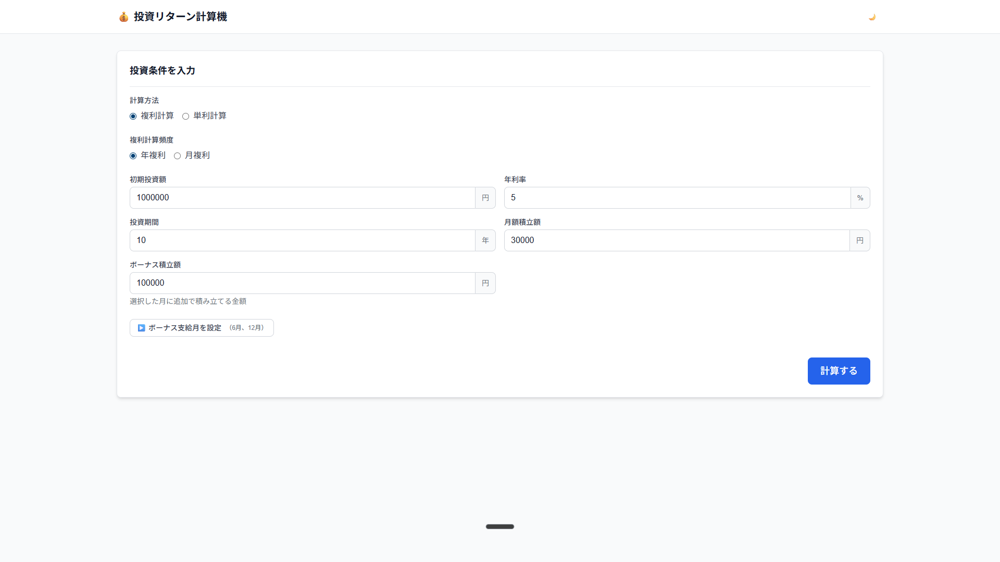

# 投資リターン計算機



複利・単利計算で資産形成をシミュレーションするWebアプリケーション

## 🚀 機能

### 実装済み機能（MVP）
- ✅ 複利計算（年複利・月複利）
- ✅ 単利計算
- ✅ 定期積立計算（月額固定）
- ✅ ボーナス積立（年2回）
- ✅ 資産推移グラフ表示
- ✅ 計算結果のCSVエクスポート
- ✅ シミュレーション保存機能（LocalStorage）
- ✅ ダークモード対応
- ✅ モバイルレスポンシブ対応

### 今後の追加機能
- 複数シナリオ比較
- 税金計算（源泉徴収考慮）
- インフレ率考慮
- 多言語対応（英語・中国語）

## 📦 技術スタック

- **Framework**: Next.js 14 (App Router)
- **Language**: TypeScript
- **Styling**: Tailwind CSS
- **Charts**: Recharts
- **State Management**: Zustand
- **Form Validation**: React Hook Form + Zod

## 🛠️ セットアップ

### 必要な環境
- Node.js 18.x以上
- npm または yarn

### インストール

```bash
# 依存関係のインストール
npm install

# 開発サーバーの起動
npm run dev

# ビルド
npm run build

# 本番サーバーの起動
npm start
```

## 📂 プロジェクト構造

```
investment-calculator/
├── app/                    # Next.js App Router
│   ├── layout.tsx         # ルートレイアウト
│   └── page.tsx           # メインページ
├── components/            # Reactコンポーネント
│   ├── calculator/        # 計算機関連
│   ├── charts/            # グラフ関連
│   ├── layout/            # レイアウト関連
│   └── ui/                # 共通UIコンポーネント
├── services/              # ビジネスロジック
│   ├── calculator.ts      # 計算ロジック
│   └── storage.ts         # データ永続化
├── stores/                # 状態管理
│   └── simulationStore.ts # Zustandストア
├── types/                 # TypeScript型定義
│   └── index.ts
└── doc/                   # ドキュメント
    ├── requirements.md    # 要件定義書
    ├── technical-design.md # 技術設計書
    └── implementation-plan.md # 実装計画書
```

## 💻 使い方

1. **初期投資額を入力**
   - 最初に投資する金額を設定

2. **年利率を設定**
   - 期待する年間利回りを％で入力

3. **投資期間を選択**
   - 何年間投資を続けるか設定

4. **月額積立額を入力**
   - 毎月積み立てる金額を設定

5. **ボーナス積立額を設定**（オプション）
   - 年2回（6月・12月）の追加積立額

6. **計算方法を選択**
   - 複利計算または単利計算を選択
   - 複利の場合は年複利か月複利を選択

7. **「計算する」ボタンをクリック**
   - 結果が表示され、グラフで視覚化されます

## 📊 計算ロジック

### 複利計算（年複利）
```
最終資産額 = 初期投資額 × (1 + 年利率)^年数 + 定期積立の複利計算
```

### 複利計算（月複利）
```
月利率 = 年利率 / 12
最終資産額 = (初期投資額 + 月額積立) × (1 + 月利率)^月数
```

### 単利計算
```
利益 = 初期投資額 × 年利率 × 年数
最終資産額 = 初期投資額 + 利益 + 積立総額
```

## 🔧 開発

```bash
# ESLint実行
npm run lint

# TypeScript型チェック
npm run type-check

# テスト実行（今後実装）
npm test
```

## 📄 ライセンス

MIT

## 👥 貢献

プルリクエストは歓迎します。大きな変更の場合は、まずissueを開いて変更内容を議論してください。
